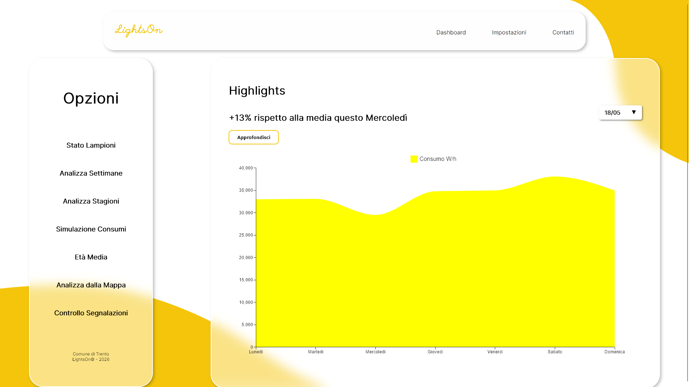
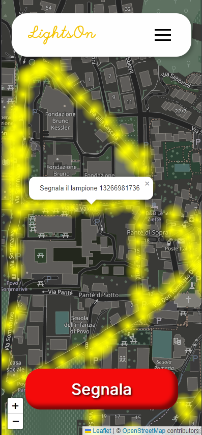

# LightsOn

**LightsOn** is a MERN application created as a Software Engineering Project at the University of Trento (UniTn).
The goal of the app is being a platform with 2 intended user personas: citizen and staff of a municipality for a smart-city.
Citizen can see in an interactive map the streetlamps that are currently on and see which don't work and they can easily report if one is not working.
Staff people have a dashboard where to visualize the current status of the lightning system of the city, see the reports and contact the producers,
have an idea of the consumes and the pricing and understand if to switch some lamps.

---

The web app is accessible
[Here](http://lightson.ddns.net/)

  
Here's a sample image of the dashboard:

  

  

and of the citizen map:

  

## Running

(Mettiamo il comando per runnare l'applicazione)

You can run a docker image of the project with:
` docker compose --profile dev up --build`

## Dependencies
The project contains the following dependencies: Cors,Express,Jsonwebtoken,Bcryptjs,react/react-dom,Mongoose,Vite,Mui,React Leaflet	/leaflet,react-router-dom,Hamburger React,Fontsource, Jest, Supertest.

## FAQ

Q: Is the Data real or fake?  
A: The data regarding streetlamps position is taken from OSM thaks to the contributors that put the position of each streetlamp. Data like Energy Price or Weather is taken 
 

Q: Should I have an account to create a report? 
A: Yes, in order to create a report for a street lamp you need an account even though the map is always visible. You could create a new account in LightsOn by just adding an email and password.
